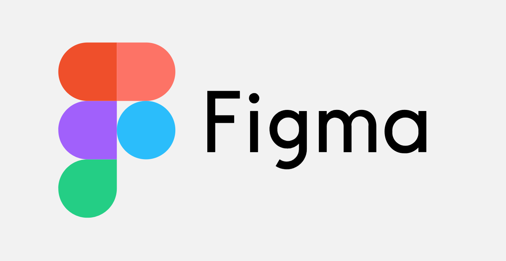
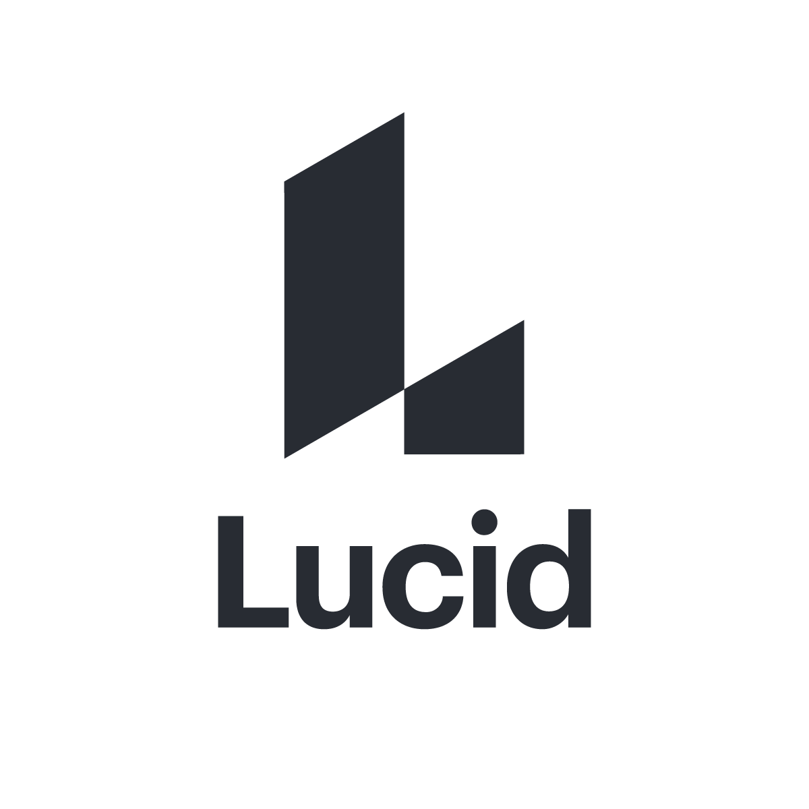

# bonjour!

## Hello world! I'm  Chiok Zechariah

- :office: &nbsp;I'm currently study in HYF
- :seedling: &nbsp;I’m currently learning **node js**
- :speech_balloon: &nbsp;I like to talk about 
**HOW I FEEL**
 and **ASK MORE QUESTION**

---

<kbd>
  
 </kbd>

## gratitude  feeling.

"I want to learn, and i want to build " i'm really happy for **[_HYF community_](https://hackyourfuture.be)** for their support.  they're part of **my foundation**, and now I begin to learn the new techniques and tools in web development. learn new skill to me I feel it like having a fun,i'd even forgot my lunches :smile::smiley::joy:

---

 

<h2 align="left" id="macropower-tech">My favorite Tech</h2>

> Tools, languages, and other things that I like to work with.

<table>
<tr>
    <td align="center" width="96">
      
       HTML5&nbsp;
    </td>
    <td align="center" width="96">
      
       CSS3
    </td>
    <td align="center" width="96">
      
       SASS
          <td align="center"  width="96">
      
       BOOTSTRAP
    </td>
        <td align="center" width="96">
      
       FIGMA
    </td>
            <td align="center" width="96">
      
       LUCID
    </td>

  </tr>
  <tr>
    <td align="center" width="96">
      
       JAVASCRIPT
    </td>
    <td align="center" width="96">
      
       REACT
    </td>
    <td align="center"  width="96">
      
       GITHUB
    </td>
        <td align="center"  width="96">
      
       VSCODE
    </td>
        <td align="center" width="96">
      
       HEROKU
    </td>
        <td align="center" width="96">
      
       EDITOR X
    </td>

  </tr>
</table>
<h2 align="left" id="macropower-tech">My favorite libraries</h2>

> The libraries, I like to search when I'm stack

<table>
<tr>
    <td align="center" width="96">
      
       STACKOVERFLOW
    </td>
    <td align="center" width="96">
      
       JSON_SCHEMA
    </td>
    <td align="center" width="96">
      
       NPM
          <td align="center"  width="96">
      
       EXPRESS-NPM
    </td>

  </tr>
  <tr>
    <td align="center" width="96">
      
       W3SCHOOL
    </td>
    <td align="center" width="96">
      
       CHAI
    </td>
    <td align="center"  width="96">
      
       JSON
    </td>
        <td align="center"  width="96">
      
       MDN DOCS
    </td>
    

  </tr>
</table>

---

### Here are some quote.

#### [Technology](https://home.hackyourfuture.be/)

The number one benefit of information technology is that it empowers people to do what they want to do. It lets people be creative. It lets people be productive. It lets people learn things they didn't think they could learn before, and so in a sense it is all about potential.

#### [Education](https://hackyourfuture.be/)

most of us end up with no more than five or ten  people who remember us. teachers have thousands of people who remember them for the rest of their life.

#### [Life](https://www.reddit.com/)

Winning is great, sure, but if you're really going to do something in life, the secret is learning how to lose nobody goes undefeated all the time. if you can pick up after a  crushing defeat, and go on to win again, you are going to be a champion someday.

#### [Dream](https://hackyourfuture.be/program)

We all have dreams. But in order to make dreams come into reality, it takes an awful lot of determination, dedication, self-discipline, and effort.

[back to the top](#bonjour)